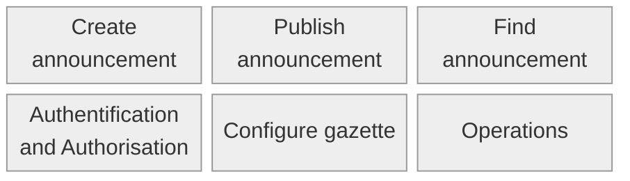

# Overview
This site provides an overview of the artifacts associated with the ePublication platform, formerly know as "official gazettes portal".

## A Harmonization of Swiss Official Publications

### Responsibilities
Seco is responsible for operating the platform. Editors use it for publication of their gazettes, in which announcements are published by publishing entities. These three main players have different roles:
The provider provides the technical infrastructure (the core system) and defines the announcement standard.
The editor uses this standard in the form of predefined announcement types. They ensure that these announcement types comply with legal requirements.
The publishing entity creates the actual announcements based on these types and publishes them in the official gazette on schedule. They are responsible for the content of the published announcements.
Each announcement is therefore based on an announcement type from the respective gazette. Consumers have no responsibility—they obtain the announcements via the gazettes.

