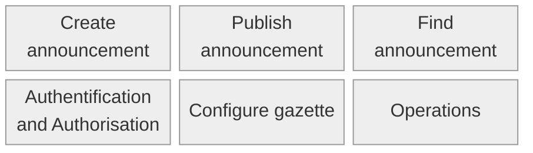

# Overview
This site provides an overview of the artifacts associated with the ePublication platform, formerly know as "official gazettes portal".

## Standard for Official Publications

### Responsibilities
SECO is responsible for operating the platform. Publishers use it to issue their official gazettes, in which reporting agencies publish notices. These three main actors have distinct roles:
The Operator provides the technical infrastructure (the core system) and defines the reporting standard.
The Publisher uses this standard in the form of predefined reporting types. They ensure that these types comply with legal requirements.
The Reporting Agency creates the actual notices based on these types and publishes them on schedule in the official gazette. They are responsible for the content of the published notices.
Thus, every notice is based on a reporting type from the respective official gazette. Consumers have no responsibility – they simply retrieve the notices via the gazettes.
Standardization
Standardization allows notices to be found using uniform filters across geographical and federal levels. It specifically facilitates automated processing and the integration of upstream and downstream processes. It also simplifies the setup of new official gazettes.
The operator standardizes a complete catalog of all reporting elements (Reporting Element Catalog) and uses it to model all possible reporting types (Reporting Type Catalog). Publishers select the appropriate reporting types for their gazette and can configure them individually if needed. Reporting agencies use these configured types as the basis for their notices. Reporting types serve as the publication templates for the notices.
The Standardized Notice – A Brief Glossary
The following terms describe the key search-relevant parameters:
Reporting Type (Meldungstyp):
Acts as the publication template and determines the structure of a notice.
Groups structurally and substantively similar notices.
Used for notices published recurringly in the same form and volume.
Defines publication modalities and search parameters.
Provided to all gazettes via a central catalog.
Can be adapted (e.g., renamed) by publishers for their specific gazette.
Publishers can determine which organization types (e.g., "Court") may access specific reporting types.
Business Case (Geschäftsfall):
Subdivides the reporting type into categories or describes it in more detail.
Always displayed first in the title.
Contains the same content elements within a reporting type.
Allows publishers to set default values for legal notices and deadlines.
The name can be customized by the publisher.
Topics (Themen):
A fixed set of thematic terms that can be assigned to notices.
A topic may be predefined by the reporting type.
Possible topics are predefined and cannot be configured by the publisher.
Must/can be added to the notice by the reporting agency depending on the reporting type.
Names of topic terms cannot be adjusted by the publisher.
Every notice has at least one topic.
Notices can be filtered by topic on the platform.

